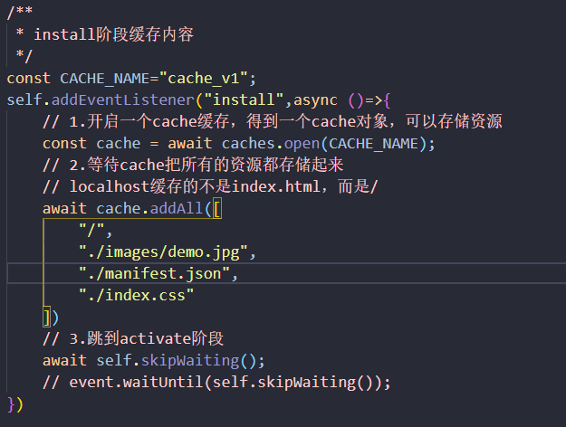
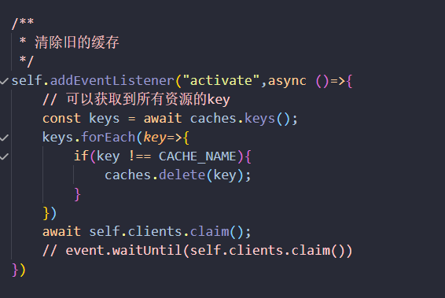
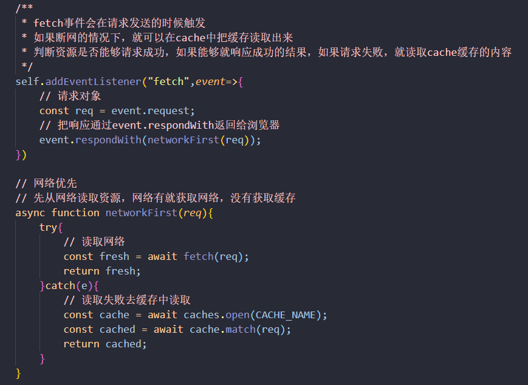

# pwa(progress web app)

> 渐进式 web app
>
> 使用一系列技术，经过一些新技术进行改进
>
> vue和react已经集成了PWA的功能,标准的pwa必须包含以下三个部分
>
> 1.必须在https协议下或者http://localhost下访问项目
>
> 2.ServiceWorker
>
> ​	浏览器在后台独立于网页运行的脚本
>
> ​	拦截和处理网络请求,操作缓存
>
> ​	支持Push API等
>
> ​	后台同步 & 更新缓存
>
> ​	使用了ServiceWorker打开页面的速度会快
>
> 3.manifest.json

优势

- 渐进式：不影响传统网页的功能，适用于所有浏览器
- 流畅：借助Service Worker在离线或者网络状态差的情况下也可以正常访问
- 可安装：可以添加常用的webapp到桌面，免去在应用商店下载的麻烦
- 原生体验：和app一样，拥有首屏加载动画，可以隐藏地址栏等沉浸式体验
- 粘性：通过推送离线通知等，可以让用户回流

#### 1.web app manifest

>应用程序清单，允许网页中手机端应用,是PWA技术集合的一部分

```json
{
    "name":"", 指定应用的名字，安装横幅提示的名字，启动画面中的文字
    "short_name":"",应用的短名称，用于主屏幕显示
    "display":"fullscreen standalone minimal-ui browser",
    	fullscreen：全屏显示
    	standalone：独立的应用程序，推荐
    	minimal-ui：会显示地址，像网页
    "start_url":"指定应用打开时的网址，添加参数用于来源统计，如果为空默认用户打开的当前页面为首屏",
    "icons":[设置桌面图标和启动画面中的图标，浏览器会根据设置的sizes字段进行选择，桌面图标48dp密度匹配,启动页面图标128dp密度匹配，src,sizes,type],144的用的比较多
    "background_color":"用于启动画面的背景颜色",
    "theme_color":"用于启动画面的状态栏和地址栏颜色"
}

注意：
	ios11.3中一些属性还是不支持，想要和安卓达到一样的启动效果，需要在meta和link标签中声明一些私有属性
	
	1.指定桌面icon
	<link rel="apple-touch-icon" href="<<= htmlWebpackPlugin.options.config.build.publicPath >>static/img/icons/apple-touch-icon-152x152.png">
	2.指定应用名称 
	<meta name="app-mobile-web-app-title" content="Lavas">
	3.是否隐藏Safari地址栏
    <meta name="apple-mobile-web-app-capable" content="yes">
	4.修改IOS状态栏颜色
    <meta name="apple-mobile-web-app-status-bar-style" content="black">
	
	pwa添加到桌面的方式
		1.手动添加
		2.通过应用引导添加
			条件
				部署manifest.json且正确配置属性
				注册Service Worker
				支持HTTPS访问
				用户在同一浏览器中访问至少两次，两次访问间隔至少为5分钟
```

#### 2.Service Worker（离线缓存新标准）

##### 	性能优化手段

核心：提高更好的用户体验

		CND内容分发
		图片合并
		资源文件压缩
		异步加载
		HTTP缓存

Service Worker达到秒开的效果，而且让页面在弱网或者无网的情况下也可以响应，原生native有的离线缓存的功能，Service Worker使Web App也有这种能力

##### web worker(基础)

- service worker是一种特殊的web worker
- 为什么要有web worker：浏览器是单线程的，同一时间只能做一件事情，应用复杂之后在主线程去做会损耗性能
- web worker是一个单独的线程，完成后通过postMessage方法告诉主线程
- web worker是一个独立的运行环境，不能操作DOM和BOM
- 使用方法
  - 创建web worker :new Worker("work.js")
  - 在web worker中进行复杂运算
  - 计算结束，通过self.postMessage(msg)给主线程发消息
  - 主线程通过worker.onmessage=function(msg){}监听消息
  - 主线程也可以用同样的方式给web worker进行通讯
- 缺点
  - web worker是临时的，每次做的事情不能被持久存下来，下次如果有同样复杂的操作，还得再来一遍

##### 工作原理

```
	Service Worker可以拦截页面向服务端发送的请求，根据条件决定是请求本地的缓存还是云端的服务，再把请求到的内容写入本地的缓存来管理
	是一种特殊的Web Worker，是浏览器运行在后台，与网页主线程独立的另一个线程，通常做一些比较耗费性能的计算，有需要的时候再和主线程通信，告诉主线程他的运算结果，这样将计算和渲染独立开，避免阻塞的情况
	Service Worker的API的前身是Application Cache的API，但是后者被移除，因为假定你在使用的时候要遵循很多规则，如果不遵循这些规则，缓存的表现可能就不会如你所愿
```

##### 特性

```
1.Service Worker是一种工作线程，由于它是子线程，所以无法直接与Dom交互，只能使用特定API，在Service Worker的上下文中是全局的，是特殊的web worker
2.需要这些API的时候可以直接唤醒，不需要自动休眠，不会因为浏览器窗口的关闭，或者与他关联的站点的窗口的关闭而失效
3.相当于可编程的网络代理，开发者可以对请求或者请求结果进行拦截，缓存的内容是开发者可控的
4.一旦安装将永远存活，除非手动卸载
5.必须在HTTPS环境下工作（本地环境除外），因为Service Worker很强大，可以让我们对请求，应答进行拦截，过滤甚至改写，需要确保这些功能是可控的，不会在网络传输的过程中被恶意篡改
6.广泛应用Promice
7.网页发送请求给server，首先请求会被service worker拦截，在service worker中可以操作缓存api，也可以发请求到服务端，类似代理服务器
```

##### 使用步骤

```
1.在window.onload中注册service worker，防止与其他资源竞争
2.navigator对象中内置了service worker属性
3.service worker在老版本浏览器中不支持，需要进行浏览器兼容性处理
	if("serviceWorker" in navigator){}
4.注册service worker navigator.serviceWorker.register("./sw.js")，返回一个promise对象
```

##### 生命周期

- 注册 `install` 阶段缓存资源
- 安装 `activate` 阶段清理缓存，主要用于删除旧的资源
- 激活  `fetch` 会接收所有的网络请求，在发送请求的时候触发，主要用于操作缓存或者读取网络资源

```
1.如果sw.js发生了改变，install事件就会重新触发
2.activate事件会在install事件后触发，但是如果已经存在service worker了，那么就处于等待状态，直到当前service worker终止
3.可以通过self.skipWaiting()方法跳过等待，返回一个promise对象，可能会导致skipWaiting没有执行完就执行下一步
4.可以通过event.waitUntil()方法接收的参数是一个promise对象，会在promise结束后才会结束当前生命周期函数，防止浏览器在异步操作之前停止生命周期
5.sevice worker激活后，会在下一次刷新页面的时候生效，可以通过self.clients.claim()立即获取控制权，activate 阶段
```

>​	Service Worker 如果需要更新，比如当前这个域中已经有Service Worker在工作了，如果这个时候修改了Service Worker的脚本，重新加载的时候，浏览器会把他当做另一个新的工作线程，会获得新的生命周期，重走注册、安装、激活的路线，新的Service Worker会被延迟激活，处于短暂的等待状态，因为同一时间只能有一个Service Worker控制这个作用域，旧的Service Worker关闭之后才能触发activate时间，才能激活新的Service Worker,如果想跳过等待时间直接激活，可以在install事件回调里调用skipwaiting方法，防止等待加快进程

`App cache`和`Service Worker`

##### Service Worker 调试工具

>Offline 模拟断网效果
>
>Update on reload  每次Service Worker都是重新安装并激活
>
>Bypass for network 不经过Service Worker请求代理，跳过Service Worker

##### Fetch API

`Service Worker`不支持`XMLHttpRequest/ActiveXObject`接口，`Fetch`同时支持`Service Worker`与`Window`环境中使用，提供了JavaScript接口，用于操控和访问http管道的部分，请求和响应，基于promise实现

```javascript
/**
	fetch 接口定义
	@param {string|Request} request 请求 URL 字符串或者 Request 对象实例
	@param {Object} options 请求配置项
	
	@return {Promise<Response>} 返回 resolve Response 实例的 promise
*/	
```

###### 几个比较重要的配置项说明：

- method:请求使用的方法：POST GET
- headers:请求的头信息
- body:请求的body信息
- mode:请求的模式
- credentials:是否自动发送 cookie,omit/same-origin/include

`fetch`先查`http`,看`http`缓存里面有没有，直接去拿

`fetch`兼容性不是很好，fetch_ployfill可以兼容IE6

```javascript
fetch("/api/movies")
	.then(function(){
		// 使用http响应
    	// 得到的response是二进制的流
    	// 调用的response.json()方法，可以把数据变成json格式，读取的是一个json数据
    	// 返回的也是一个promise
    	return res.json()
	}).then(data=>{
    	// 在这里的是return res.json()返回的数据
	}).catch(function(){
		// 处理错误err
	})
```

##### 重要***Cache Storage 和 Cache API

>两个与缓存有关的接口，用于管理当前网页的缓存，可以通过全局变量 caches 来访问 Cache Storage 的数据，与之相关的方法都是异步的，返回Promise

###### cache storage

> cacheStorage接口表示cache对象的存储，配合service worker来实现资源的缓存

###### caches api 类似于数据库的操作

- caches.open(cacheName).then(function(cache){}),用于打开缓存，返回一个匹配cacheName的cache对象的promise,类似于连接数据库
- caches.keys()返回一个promise对象，包括所有缓存的key（数据库名）
- caches.delete(key)根据key删除对应的缓存（数据库）

###### cache对象的常用方法

- cache 接口为缓存的Request/Response 对象对提供存储机制
- cache.put(req,res)把请求当做key,并且把对应的响应存储起来
- cache.add(url)根据URL发起请求，并且把响应结果存储起来
- cache.addAll(urls)抓取一个URL数组，冰球把结果都存储起来
- cache.match(req),获取req对应的response

###### 没有动态数据改变的数据请求流程







##### notification通知

>1.notification api的通知接口用于向用户配置和显示桌面通知
>
>2.Notification.permission可以获取当前用户的授权情况

- Default：默认的，未授权
- Denied:拒绝的，如果拒绝了，无法再次请求授权，也无法弹窗提醒
- Granted:授权的，可以弹窗提醒

>3.通过Notification.requestPermission()可以请求用户的授权
>
>4.通过new Notification（{"title":{body:"",icon:""}）可以向用户显示通知
>
>5.在授权通过的情况下，可以在service worker中显示通知self.registration.showNotification("你好"，{body:"msg"})

```javascript
/**
	如果一进来,发现用户没有联网，给一个通知
*/
// 先判断Notification是否有权限
if(Notificaiton.permission === "default"){
    Notification.requestPermission()
}
if(!navigator.onLine){
	new Notification("提示"，{body:"你当前没有网络，访问的是缓存"})   
}
// offline事件也可以给通知
window.addEventListener("online",function(){
    new Notification("提示"，{body:"你已经连上网络了，请刷新访问最新的数据"}) 
})
```

##### Service Worker 版本更新

>流程
>
>​	page请求Service worker
>
>​	new Service Worker
>
>​	install阶段可以进行precache的操作
>
>​	进入skipWaiting,直接调用Service Worker的skipWaiting方法，直接获得控制权，让上一个service worker直接register
>
>​	进入activate,需要清除旧的缓存 clear stale cache,完成之后提示用户页面已经更新，需要刷新

##### 常见缓存策略

-  `css`和某些`js`这些静态资源可以优先从缓存中获取，因为不会变化，缓存中获取失败了再从网络中获取
- 动态接口：每次请求需要获取最新的数据，所以应该优先从网络中获取，失败了再从缓存中获取，每次从网络中获取的时候要更新到本地的cache中
  - Cache only
    - 所有资源请求直接从缓存获取返回，如果在缓存中找不到，请求将失败。该模式假定资源之前已被缓存，可能在install期间就做了缓存，适用于静态资源
  - Network only
    - 只从网络返回，使用前端用户行为日志打点之类的请求，
  - Cache,falling back to cache
    - 优先从cache中返回，如果失败了从网络请求，网络失败则失败
  - Network,falling back to cache
    - 优先从网络返回内容，如果失败了则从缓存获取。适用于频繁更新的内容，希望用户总是看到最新的内容
  - Cache & network race
    - 同时从cache和网络获取内容，取最快响应得到内容返回。应用场景少，对比较老的设备从硬盘读取数据比较慢的情况适用
  - Cache then network
    - 优先从cache返回内容，同时从网络获取最新内容，如果网络内容比较新，则更新缓存，并更新页面内容。UX（用户体验）实现难度比较大
  - Generic fallback
    - 先从cache中获取数据，cache没有则从网络获取，如果网络也不可用，返回缓存中默认内容。适用于默认图片之类的场景（比如用户头像）

##### 注意事项

- 避免http缓存service worker文件，浏览器service worker文件最多只能缓存24小时

  - 根据service worker响应头的cache-control设置no-cache

- 避免缓存跨域资源

  - 由于更新机制的问题，如果Service Worker缓存了错误的结果，将会对web应用造成灾难性的后果。我们必须小心翼翼的检查网络返回是否准确。一种常见的做法是只缓存满足如下条件的结果：
    - 响应状态码为200；避免缓存304,404,5xx等常见的结果
    - 响应类型为basic或者cors；即只缓存同源，或者正确的跨域请求结果；避免缓存错误的响应和不正确的跨域请求响应

- 注意存储空间（需要及时清理缓存）

  | 浏览器  |     限制     |  逐出策略  |
  | :-----: | :----------: | :--------: |
  | Chrome  | 可用空间<6%  |  LRU策略   |
  | Firefox | 可用空间<10% |  LRU策略   |
  | Safari  |    < 50MB    | 无逐出策略 |
  |  IE10   |   < 250MB    | 无逐出策略 |

  注意：以上的方法和实现都有现成的解决方案，不需要手动实现代码，根据需要配置即可

  #### 处理Service Worker工具

  - sw-precache 预缓存
    - 有对应的webpack插件

  ```javascript
  new SWPrechacheWebpackPlugin({
  	cacheId:"sw-tools",
  	filename:"service-worker.js"
  })
  
  /**
  	生成的service-worker.js中有precacheConfig预缓存列表，是一个数组，包含了每一个静态资源以及他的版本号
  	在代码发生变动需要重新构建的时候，版本号也会改变
  */
  ```

  >在sw-precache生效的时候，会在缓存中开辟一个新的缓存，把列表中列出来的静态资源请求一遍，放入缓存中

  - sw-toolbox 动态缓存

  ```javascript
  // 只需要在静态资源配置中加入runtimeCaching配置，可以配置所需资源规则以及在这部分规则中的缓存策略
  new SWPrechacheWebpackPlugin({
  	cacheId:"sw-tools",
  	filename:"service-worker.js",
  	runtimeCaching:[{
  		urlPattern:"/.*\.png$",
  		handler:"networkFirst"
  	}]
  })
  
  /**
  	除了之前的precache代码，自动生成的规则里面还将包括自动引入的sw-toolbox代码，还有根据配置结果所生成的调用toolbox api的语句,第一部分的语句是资源路由的匹配规则，所有命中这部分规则的资源，都会接收配置的缓存策略
  */
  toolbox.router.get("/.*\.png$",toolbox.netWorkFirst,{})
  ```

  - workbox 终极方案
    - 有对应的webpack插件

  ```javascript
  // 如果使用已有的Service Worker利用插件注入特殊的功能代码
  new WorkboxWebpackPlugin.InjectMainfest({
      // 已有service worker路径
      swSrc:path.resolve(__dirname,"src/service-worker.js"),
      // 目标service worker名称
      swDest:"service-worker.js",
      // 图片不加入预缓存列表
      exclude:[/\.png$/],
      // 使用本地的workbox,默认的配置代码会放google的cloud上面，这部分资源我们在国内无法访问，通过local的选项把代码拷贝到本地，在运行的时候使用本地代码
      importWorkboxFrom:"local"
  })
  
  /**
  	可以像使用window这样的全局对象一样使用workbox,
  	在实际构建的时候，workbox会向已有代码的顶部注入两行代码，通过importScripts引入两个文件，第一个文件是在构建的时候生成的预缓存列表，第二个是告诉workbox把代码拷贝到本地
  	self.__precacheMainfest就是预缓存列表，给每一个静态资源一个版本号
  
  */
  // 静态缓存
  workbox.precaching.precacheAndRoute(self.__precacheMainfest);
  // 动态缓存
  workbox.routing.registeraRoute(
      // 所有图片类型的资源使用CacheFirst缓存
  	/.*\.(?:png|jpg|jpeg|svg|gif)/g,
      workbox.strategies.cacheFirst({
          // 通过cacheName指定新的缓存
          cacheName:"my-image-cache"
      })
  )
  // 配置缓存名称,在service-worker.js中配置
  workbox.core.setCacheNameDetails({
      prefix:"sw-tools",
      suffix:"v1",
      precache:"precache",
      runtime:"runtime-cache"
  })
  // 跨域请求，是不透明的响应，无法读取响应内容和状态码
  // 服务器配置CORS跨域资源共享
  // 如果对cdn得资源在跨域且没有配置CORS的情况下设置cacheFirst策略，如果请求成功还好，一旦请求失败，就把失败的资源永远放在了缓存中，使用了CacheFirst，用户很难更新到成功的代码，所以workbox对所有cacheFirst请求都会报个错，如果是networkFirst或者staleWhileRevalidate的策略，会通过，在下面的请求中，错了有机会更新他，cacheFirst很难更新
  ```

  

  ##### 工具特性

  ​	可以通过命令行方式使用，也可以通过构建工具插件

  ​	可以向已有的Service Worker中注入的工作，也可以生成全新的Service Worker

  ##### 预缓存

  `App Shell`包括运行的最小资源集合，包括`html`，`css`,`js`，需要被快速加载，并且可被缓存，

  采用`cacheFirst`缓存，这部分叫做预缓存

  ```javascript
  // 发生在install阶段
  // 打开缓存，请求一个列表的所有静态资源，成功之后放入缓存中
  // 每次构建的时候都需要重新生成
  ```

  ##### 动态缓存

  有些内容是动态的，比如`api`或者第三方资源，用户头像，这部分资源不希望在构建的时候把他写进列表里请求，希望在实际请求的时候再去缓存，叫做动态缓存

  `http-server`可以在当前目录下启动项目